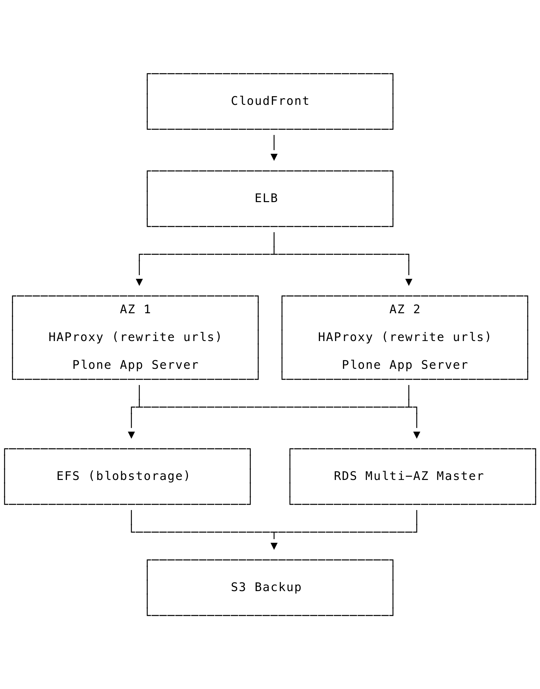

# Who are these guys?

::: notes
* Six Feet Up
* IndyPy
* IndyAWS

Python, Plone Django
Wrote the Plone Training Section on Workflows
:::

# Beautiful Unique Snowflakes are not reproducible. {.semi-filtered data-background-image="https://c2.staticflickr.com/4/3802/12006571534_7a81e7656e_o.jpg"}

::: notes
tidbit of trivia, the chances of a snowflake being exactly alike is 1 in 1 million trillion (that's a 1 followed by 18 zeros)
:::

# Pets {.semi-filtered data-background-image="https://c2.staticflickr.com/6/5233/5828169497_dff82c6543_o.jpg"}

::: notes
coined by Randy Bias after hearing a talk from Bill Baker on Scaling SQL Server
:::

# Cattle {.semi-filtered data-background-image="https://c1.staticflickr.com/9/8131/8714106252_4e66254faa_o.jpg"}

::: notes
We are now in the world of DevOps and many non-cloud native applications have the ability to be deployed with cloud native tools.
How do we take a beautiful handcrafted bare-metal server running our application to translate that into the cloud?
:::

# From the Closet to the Cloud {.semi-filtered data-background-image="https://c2.staticflickr.com/8/7063/13991487412_7d4a652f38_o.jpg"}

::: notes
College of Engineering at Notre Dame has been hosting their main web site on a single server in a closet on campus since we deployed it for them back in 2011.

In 2016 the university mandated a move to AWS campus wide.

Perfect opportunity to take this aging single server hosting their site and improve their performance and resilience to potential failure.
:::

# Single Server Monolith

{.stretch}

# Cloud Optimized {.semi-filtered data-background-image="https://c2.staticflickr.com/6/5484/11423341454_b51b661bc5_k.jpg"}

{.stretch}


::: notes
But how do we make it repeatable.
Automation
Terraform and Saltstack
:::

# Network

{.stretch}

# Bit of a Chicken and Egg Problem {.semi-filtered data-background-image="https://c2.staticflickr.com/8/7508/16136177877_b59f6a4585_k.jpg"}

::: notes

How do we get a fresh Salt master into a region to start building the rest of the infrastructure.

SaltStack has support for various cloud providers, but the easiest was to just use Python and Boto3 to bootstrap the process.

A few lines of Python and you have a VPC ready to be your command and control in any region.

:::

# Orchestrate!

```sh
$ salt-run state.orchestrate orch.deploy-environment pillarenv=prod
```

And build a `test` environment

```sh
$ salt-run state.orchestrate orch.deploy-environment pillarenv=test
```

# Save Money with Python in the Cloud

```yaml
policies:
  - name: offhours-stop-ec2
    mode:
      type: periodic
      schedule: "rate(1 hour)"
      role: arn:aws:iam::243886768005:role/cloud_custodian
    resource: ec2
    filters:
      - type: offhour
        default_tz: America/Indiana/Indianapolis
        offhour: 16
    actions:
      - stop
```

::: notes
[Cloud Custodian](https://github.com/cloud-custodian/cloud-custodian) can be used to spin down and garbage collect unused resources in your AWS cloud.

Notre Dame doesn't need their testing environment running 24/7, but it needs to match production specs so we can catch issues prior to release to Production. Cloud Custodian can spin it up for the few hours they may use it each day and stop it for the rest.

This works with many of the AWS resources such as RDS.
:::

# Sounds too easy {.semi-filtered data-background-image="https://c1.staticflickr.com/1/229/498818720_73a25bdf70_o.jpg"}

The road was bumpy for sure.

Satisfying the rules for no special cases was tricky.

# Mindfulness {.semi-filtered data-background-image="https://c1.staticflickr.com/5/4397/36076284124_134a37e792_o.jpg"}

> There should be one, and preferably only one, obvious way to do it.
> Although that way may not be obvious at first unless you're Dutch.
-- _The Zen of Python_

# The journey of 3 operating systems {.semi-filtered data-background-image="https://c1.staticflickr.com/5/4902/30826204837_7d745d224f_k.jpg"}

- `2a67758 Editing requirements to run properly on amazon linux`

- `472d844 Refactoring to run CentOS 7 machines`

- `dd67b7a Refactoring for FreeBSD`

What happened here?

# Thanks! {.semi-filtered data-background-image="https://c1.staticflickr.com/1/92/239595034_d51a99ced1_o.jpg"}

## <calvin@sixfeetup.com>

[`@calvinhp`](https://twitter.com/calvinhp)
